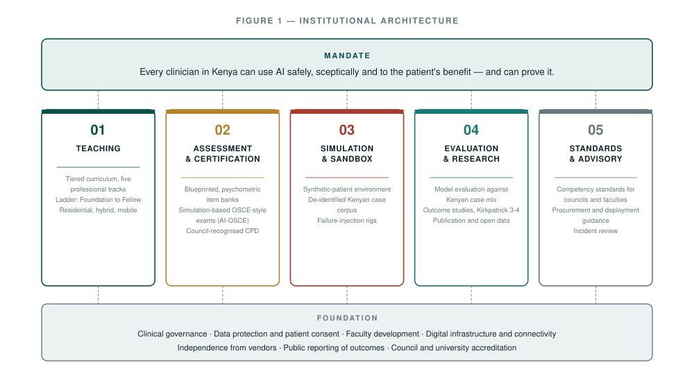
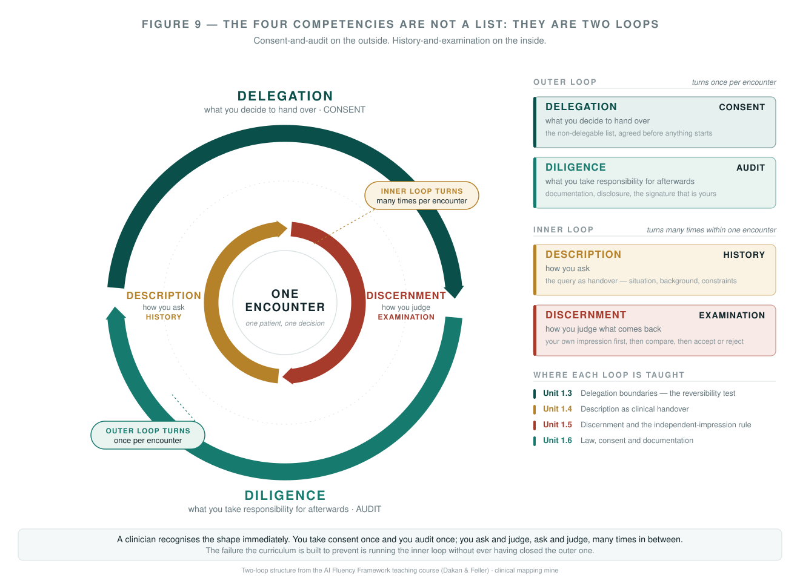
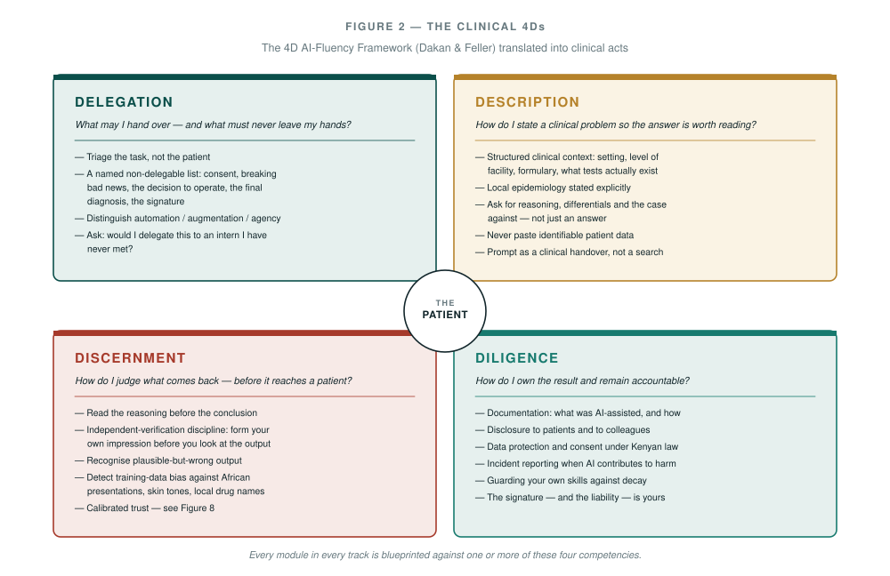
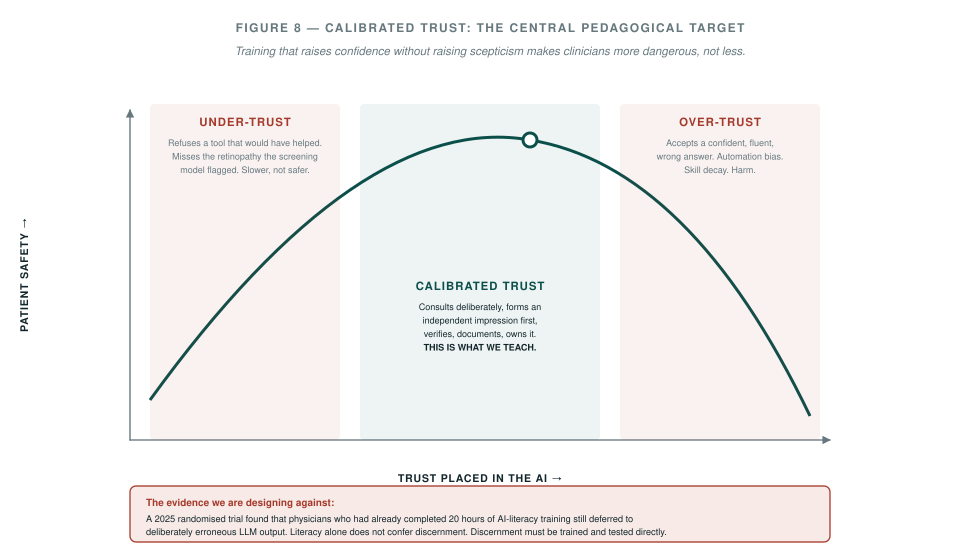
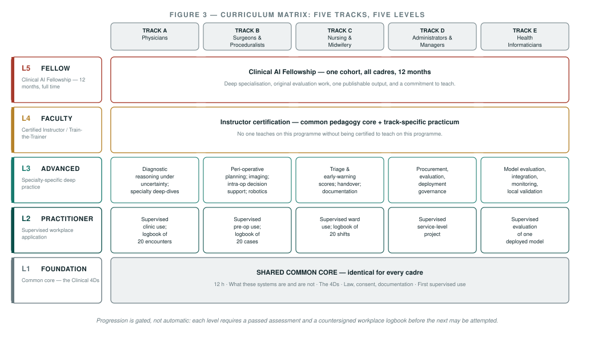
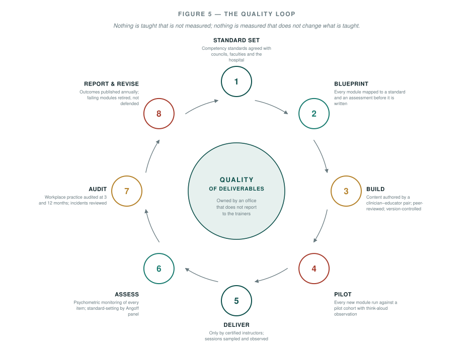
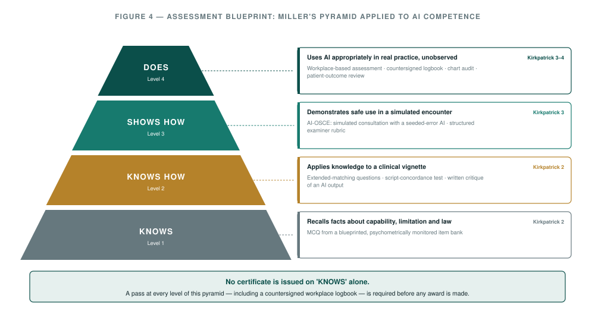
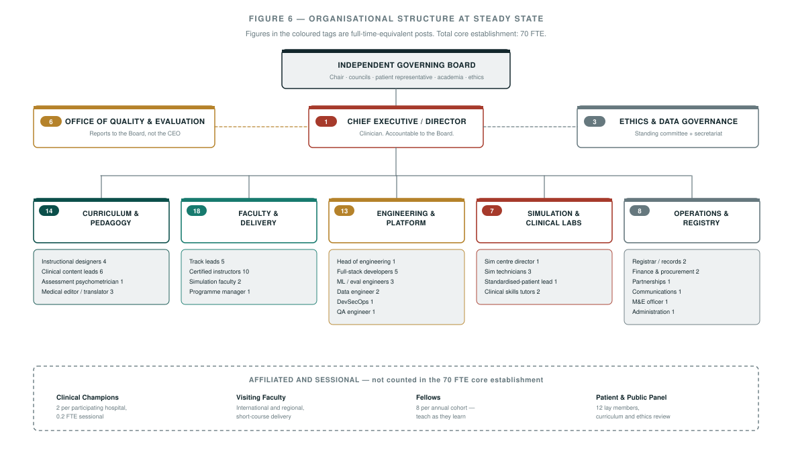
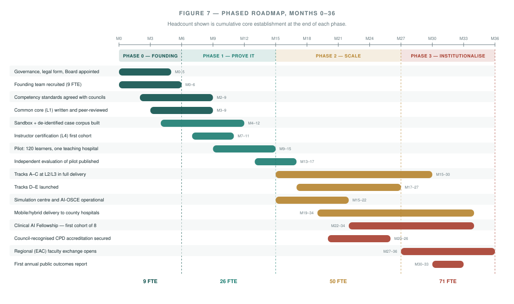

# Another Arrow in the Quiver

### What I would build to teach clinical artificial intelligence to Kenya's doctors, surgeons and nurses — and how I would make sure it works

---

## A note on why I am writing this

I have spent my working life at an unusual junction. I trained in medicine and I have operated. I have also built systems — engineering, information technology, and latterly artificial intelligence. For most of my career those two halves sat in separate rooms of my head, and I was periodically irritated by how little the people in one room knew about what the people in the other were doing.

That separation is no longer sustainable, and it is no longer merely irritating. It is becoming dangerous.

Artificial intelligence has arrived in Kenyan clinical practice ahead of any coherent plan for teaching clinicians how to use it. It arrived, as these things do, informally: a clinical officer in a busy outpatient department typing a differential into a chatbot on a personal phone between patients; a registrar drafting a discharge summary with a model that has never seen a Kenyan formulary; a consultant checking a dose at two in the morning against a system nobody has validated against our epidemiology. None of these people were taught to do this. None of them were taught *not* to. Nobody assessed whether they could tell a good answer from a confident wrong one.

This document sets out what I would build to close that gap, and — more importantly — how I would prove that it worked.

*I write here in a personal capacity.*

I want to be clear at the outset about the position I am arguing from, because it determines everything that follows.

**I do not think artificial intelligence is going to practise medicine.** I think it is going to be a tool that people who practise medicine will carry. The right analogy is not the arrival of a new colleague. It is the arrival of the stethoscope, the ultrasound probe, the pulse oximeter, the laparoscope. Each of those was, at introduction, greeted by a mixture of exaggerated hope and exaggerated fear. Each turned out to be a tool: enormously useful in trained hands, useless or harmful in untrained ones, and never a substitute for the judgement of the person holding it.

A clinician in 2026 walks into a consulting room carrying a quiver. In it are history-taking, examination, pattern recognition earned over thousands of patients, the laboratory, imaging, the formulary, guidelines, colleagues, and the accumulated literature. AI is another arrow. It is a peculiar arrow — it is fluent, it is fast, it is confidently wrong in ways that no previous tool has been, and it flatters the user — but it is an arrow, not an archer.

My entire argument is that a clinician who does not have that arrow is, in 2026, offering their patient a lower standard of care than they could. And a clinician who has it but has never been taught to draw it properly is offering something worse than that: care that *appears* better and is not.

That is the problem this institution exists to solve.

---

## Part I — The Case

### 1.1 Why this is urgent, specifically here, specifically now

Kenya is not a bystander in clinical AI. It is one of the places where the most consequential real-world evidence is being generated.

In 2025, a study across fifteen primary-care clinics in Nairobi examined nearly 40,000 patient visits in which clinicians had access to an AI decision-support tool integrated into the electronic record. It reported a 16% relative reduction in diagnostic errors and a 13% relative reduction in treatment errors among clinicians who actually engaged with the tool. That is a substantial signal, and it was generated *here*, on our case mix, by our clinicians.

But read the same body of work carefully and a second finding sits alongside the first, less comfortable and far more instructive: the benefit was concentrated among clinicians who used the tool *well*. Uptake and quality of engagement varied enormously between individuals. The technology did not distribute its benefit evenly. It distributed it to the people who knew how to use it.

That is the entire case for this institution in a single sentence. **The variable that determines whether clinical AI helps or harms a Kenyan patient is not the model. It is the training of the clinician sitting in front of it.**

And we know — this is the part that should worry every medical educator — that the obvious response is not sufficient. A randomised trial published in 2025 took physicians who had *already completed twenty hours of AI-literacy training*, gave them clinical cases, and exposed half of them to deliberately erroneous output from a large language model. They deferred to it. Prior literacy training did not protect them. Confidence in the tool had been raised; scepticism had not.

I have thought about that finding more than any other in this field, and it is the axis on which I would design the whole curriculum. **Teaching clinicians what AI can do, without simultaneously and rigorously training the reflex of doubt, produces a clinician who is more dangerous than the one you started with.** It is the equivalent of teaching someone to place a central line without teaching them to recognise a pneumothorax.

### 1.2 The policy window is open, and it will not stay open

Three things are true in Kenya simultaneously, and they will not all remain true indefinitely.

**The legal scaffolding exists.** The Digital Health Act 2023 established a Digital Health Agency and, crucially, set out data principles — health data as a strategic national asset, safeguarded privacy, interoperability — and provided for standards governing telemedicine and e-learning. The Data Protection Act 2019 governs the handling of personal data. There is a legal frame within which a training institution can operate lawfully and teach clinicians to operate lawfully.

**The national strategy names health as a priority.** Kenya's National Artificial Intelligence Strategy 2025–2030 identifies healthcare as a priority sector and lists talent development as a cross-cutting enabler. The strategic intent is written down.

**The workforce is in place and it is young.** Kenya has roughly doubled its health workforce over the past decade to something approaching 190,000 active health workers across the major occupations. Density remains below the SDG threshold — around 30 doctors, nurses and clinical officers per 10,000 population against an index threshold of 44.5 — which is precisely the condition under which a well-trained clinician's productivity matters most.

What is missing between the strategy and the workforce is the institution. Strategy documents do not teach anybody anything. Somebody has to build the thing that turns policy into competence, and then measure whether the competence is real.

### 1.3 Why this would be the first institution of its kind anywhere in the world

I want to state this plainly, and then defend it, because it is a strong claim and I do not make it loosely.

**What I am describing would be a one-of-a-kind institution the world over. It does not currently exist anywhere on earth.**

There are, of course, excellent things that are adjacent to it. Mount Sinai runs a mid-career data and AI skills programme for its faculty. Harvard Medical School and the Harvard Chan School run executive and continuing-education courses on AI in clinical medicine and its implementation. The University of Florida has built an AI-in-medicine curriculum. The AAMC is developing AI competencies across the medical education continuum, and the proportion of North American medical schools incorporating AI into their curricula rose from 53% to 77% in a single year. Anthropic, working with Professors Rick Dakan and Joseph Feller, has released a genuinely excellent open framework and course series on AI fluency. Several radiology and informatics fellowships exist.

Every one of those is a **course**, a **fellowship**, or a **curricular component within an existing school**. Each serves one institution, one specialty, or one professional stratum. Each is, essentially, an elective.

What does not exist anywhere is this:

> A permanent, national, publicly-accountable institution whose sole mandate is the clinical AI competence of an entire country's health workforce — every cadre, from the consultant surgeon to the ward nurse to the hospital administrator — delivering competency-gated certification tied to professional licensure, assessed by simulation and by workplace observation rather than by attendance, and publishing its own outcome data whether or not the outcomes are flattering.

Nobody has built that. Not the United States, not the United Kingdom, not Singapore, not Germany. The wealthy systems have distributed the problem across a thousand medical schools, professional colleges and vendor training programmes, each optimising locally, none accountable for the whole. That fragmentation is a function of their size and their institutional inertia, and they will be years unwinding it.

Kenya's position is different, and the difference is an advantage. Our regulatory councils are national and singular. Our CPD architecture is already mandatory and already centrally administered — the Kenya Medical Practitioners and Dentists Council requires 50 CPD points per calendar year for retention on the register; the Nursing Council of Kenya operates its own points requirement for licence renewal. Our health system has a clean six-level structure from community units to national referral hospitals. We have a national AI strategy that names health. We have a digital health statute. And we have the rare and precious circumstance of a workforce that is adopting a technology *right now*, in real time, before habits have calcified.

**A country that trains its entire clinical workforce to a single, measured, published standard of AI competence will be the first country in the world to have done so.** Every health system on earth is going to have to solve this problem. Kenya can solve it first, solve it in the open, and hand the solution to everybody else.

I do not think that is grandiosity. I think it is an accurate reading of a narrow window. The institution I am describing would place Kenya at the spearhead of this development for the whole of humanity — not because we are wealthier or better resourced than others, but because we are more agile, because we are already generating the evidence, and because we would be willing to publish what we found. The countries that will follow us are the ones currently writing committee reports about it.

### 1.4 What I am *not* proposing

Three disclaimers, because the failure modes here are well known and I would rather name them at the front.

**This is not a programme to make clinicians into machine-learning engineers.** A very small number of our fellows will go deep into model architecture. The overwhelming majority of the workforce needs something quite different: the judgement to use a tool safely. Confusing those two is the commonest error in this field and it produces curricula that are simultaneously too technical to be useful and too shallow to be rigorous.

**This is not a vehicle for any vendor.** The institution must be able to teach against, criticise, and if necessary publicly fail any commercial system, including systems deployed in the hospitals it serves. That independence has to be structural, not aspirational — I return to how in §5.7.

**This is not a substitute for clinical training.** If a clinician's underlying medicine is weak, AI will not fix it; it will amplify the weakness and make it fluent. Entry to every track presumes existing professional registration and competence in the discipline. We are adding an arrow to a quiver; we are not issuing the quiver.

---

## Part II — The Institution

### 2.1 Name, mandate and legal form

I would call it the **Kenya Institute for Clinical Artificial Intelligence** — the Institute, hereafter. Its mandate would be a single sentence, and I would have it carved somewhere visible:

> **Every clinician in Kenya can use artificial intelligence safely, sceptically, and to the patient's benefit — and can prove it.**

Note the last four words. They are the ones that make this an institution rather than a lecture series.

The Institute would be established as a semi-autonomous training and standards body hosted by a major teaching hospital, with its own governing board, its own budget line, and — this matters more than anything else in this section — **the legal capacity to withhold a certificate.** An institution that cannot fail a candidate is not a training institution; it is a conference.

### 2.2 The five functions

The Institute does five things. It does not do a sixth, and I would resist mission creep with some energy.

**1. Teaching.** A tiered curriculum across five professional tracks, delivered residentially, in hybrid form, and through a mobile unit that goes out to county facilities. Detailed in Part IV.

**2. Assessment and certification.** Blueprinted, psychometrically monitored assessment leading to awards recognised by the professional councils for CPD. This is the function that gives the teaching its teeth. Detailed in Part V.

**3. Simulation and sandbox.** A safe environment in which a clinician can be wrong without a patient paying for it — including, critically, an environment in which the AI can be *deliberately made wrong* so that the learner can practise catching it. Detailed in §3.6.

**4. Evaluation and research.** Independent evaluation of AI systems against Kenyan case mix, and outcome research on the Institute's own training. Detailed in §5.5 and §5.6.

**5. Standards and advisory.** Competency standards offered to the councils and the faculties; procurement and deployment guidance for hospitals; a standing incident-review function for cases in which AI contributed to harm.

### 2.3 Governance, and why it must be uncomfortable

The Institute would be governed by an independent board — chaired by a senior clinician not employed by the Institute, and including representation from the professional councils, the universities, a bioethicist, an information-security specialist, and at least two lay members drawn from a standing patient and public panel.

I would build three specific irritants into the governance, because an institution that is comfortable is an institution that has stopped checking itself:

**The Office of Quality and Evaluation reports to the board, not to me.** The people who measure whether the training works must not be paid by the people who deliver it, and must not be promotable by them. This is the single most important structural decision in the whole design and it is the one most likely to be quietly eroded within three years if it is not written into the founding instruments.

**Outcomes are published annually, including the bad ones.** Pass rates, failure rates, dropout, the modules that did not work, the assessments that turned out to have poor discrimination, and any incident in which a trained clinician's use of AI contributed to patient harm. A training institution that only publishes its successes is generating marketing, not evidence.

**A patient and public panel reviews the curriculum.** Twelve lay members, properly remunerated for their time, who read what we propose to teach clinicians about how to use AI on them. If we cannot explain a module to them, we do not understand it well enough to teach it.

### 2.4 Where it sits physically

A single teaching-hospital-based headquarters with the simulation centre, the assessment hall, the engineering team and the sandbox infrastructure. Two regional satellites in Phase 3. And a **mobile delivery unit** — a vehicle, a generator, a satellite uplink, a set of laptops and two instructors — because a substantial fraction of the workforce we most need to reach works at Level 3 and Level 4 facilities that they cannot leave for a week.

I want to be blunt about this: if the Institute becomes a thing that happens in Nairobi to people who can afford to come to Nairobi, it will have failed at its actual purpose while appearing to succeed. The metric I would watch hardest is not enrolment. It is the geographic and cadre distribution of enrolment.

---

## Part III — The Pedagogy I Would Insist On

This is the part of the document I care about most, and it is the part where I would be least willing to compromise.

### 3.1 Ten commitments

These are the pedagogical positions I would hold, and I would want them written into the founding documents so that a future director has to argue publicly to abandon them.

**1. We teach judgement, not tools.** Tools change every six months. Judgement does not. Any module that would be obsolete if the underlying system were replaced tomorrow is a badly designed module. I would test every proposed module against this question: *if the vendor disappeared overnight, would this teaching still be worth anything?* If no, it is training, not education, and it belongs in a vendor manual.

**2. Scepticism is trained explicitly, and it is assessed.** See §3.3. This is not a lecture on limitations. It is a trained reflex, drilled the way we drill the recognition of a deteriorating patient.

**3. Nothing is taught that is not assessed, and nothing is assessed that was not taught.** Constructive alignment, rigorously applied. Every module is blueprinted to a competency and an assessment item *before* it is written.

**4. Attendance certificates are abolished.** The Institute issues no award for having been present. Every award requires demonstrated competence. This will make us unpopular and it is not negotiable.

**5. All teaching is case-based and Kenyan.** Not a single vignette involving insurance codes, drugs we cannot obtain, or investigations we do not have. The cases are drawn from our facilities, our formulary, our epidemiology, and they specify the level of facility at which the clinician is working.

**6. Simulation before patients, always.** No learner touches a real clinical workflow with an AI tool until they have demonstrated safe use in simulation. This is uncontroversial for central lines. It should be uncontroversial here.

**7. The learner produces something.** Every level requires an artefact — a logbook, a critique, an evaluation, a taught session — that a named senior person has read and countersigned. Passive consumption of content teaches almost nothing that persists.

**8. Interprofessional wherever the work is interprofessional.** Ward AI use is not a doctor problem or a nurse problem; the failure modes live in the handover between them. Where the clinical work is done by a team, the training is done by the team.

**9. Faculty are certified, and their teaching is observed.** No one teaches on this programme without having passed the instructor track. Sessions are sampled and observed. Feedback is given, and repeated poor teaching ends a teaching appointment.

**10. We measure at Kirkpatrick 3 and 4, or we admit we do not know.** Satisfaction scores are close to worthless. What we care about is whether behaviour changed in the workplace and whether patients were better off. Where we cannot measure that, we say so publicly rather than substituting a happy-sheet.

### 3.2 The intellectual spine: the Clinical 4Ds

I would not invent a competency framework from scratch. There is a good one, it is well constructed, it is open, and reinventing it would be vanity.

The **AI Fluency Framework** — and its four core competencies, Delegation, Description, Discernment and Diligence — was developed by Professor Rick Dakan of Ringling College of Art and Design and Professor Joseph Feller of Cork University Business School, University College Cork, and elaborated into a course series in partnership with Anthropic, with support from Ireland's Higher Education Authority through the National Forum for the Enhancement of Teaching and Learning. It defines AI fluency as the ability to work effectively, efficiently, ethically and safely within the emerging modalities of human–AI interaction.

A licensing point that matters practically, and which I would want the Institute's lawyers to confirm before a line of curriculum is written: the two artefacts carry **different** licences. The open course materials, including video, are released under Creative Commons **BY-NC-SA 4.0** — attribution, non-commercial, share-alike — which permits adaptation provided we credit the authors and release our derivative under the same terms. The authors' *Framework for AI Fluency (Practical Summary Document)*, version 1.1, is released under Creative Commons **BY-NC-ND 4.0** — NoDerivatives — which permits redistribution but not adaptation. In practice this means we may build a clinical adaptation from the course materials and must cite rather than remix the summary document. I would want that distinction respected scrupulously, and I would in any case write to both professors before we started. Building an institution about diligence on a careless reading of somebody else's licence would be an unpromising start.

I have studied the course series built on it — the foundational *Framework and Foundations* course, *Teaching AI Fluency*, the educator adaptation built with Teach For America, the student adaptation, and the introductory *Claude 101* material. What is instructive is not the content of any one of them but the *method*: each takes the same four competencies and re-instantiates them inside the actual working life of a specific profession, with that profession's constraints, accountabilities and values taken seriously rather than treated as noise. The pK–12 educator course, for instance, is explicitly built around the reality that educators work with limited resources, answer to multiple stakeholders, and do mission-driven work — and it treats those as design constraints rather than obstacles.

Before the competencies, the framework sets out three **modalities** of human–AI interaction, and I find them unusually useful clinically because they carry different risk profiles:

| Modality | Framework definition | Clinical instance | Dominant risk |
|---|---|---|---|
| **Automation** | AI performs a task independently on direct human instruction | Drafting a discharge summary from structured notes | Unreviewed output entering the record |
| **Augmentation** | AI and human co-define and co-execute a task iteratively | Working through a difficult differential | Anchoring; the clinician's own reasoning quietly revised |
| **Agency** | Human configures AI to perform future tasks independently, including for others | A triage assistant configured once and left running on a queue | Harm at scale, with no clinician in the room when it occurs |

Teaching clinicians to name which modality they are in — before they act — is one of the highest-yield twenty minutes in the whole common core. Almost all the serious failure modes I can construct involve someone operating in agency mode while believing they are in augmentation mode.

The framework's teaching course adds one further structural idea that I would take wholesale, because it maps onto clinical work almost too neatly. The four competencies are not a list; they are two **loops**. Delegation and Diligence form the outer loop — what you decide to hand over, and what you take responsibility for afterwards. Description and Discernment form the inner loop — how you ask, and how you judge what comes back — and it turns round many times within a single encounter. A clinician will recognise the shape immediately: it is the same relationship as consent-and-audit on the outside, history-and-examination on the inside. I would teach it in exactly that language.

The dynamic matters as much as the shape. The outer loop turns **once** per encounter; the inner loop turns **many times** inside it. The failure this curriculum exists to prevent is a clinician running the inner loop with great fluency — asking well, judging well, iterating — having never closed the outer one.

That is exactly the move I want to make for clinicians. Our constraints are: a duty of care, a regulator, a coroner, an unforgiving error cost, a patient in front of us who did not consent to be an experiment, and a working environment where the AI tool is competing for attention with a queue of forty people. Those are not noise. They are the design brief.

So I would adapt the 4Ds into what I would call the **Clinical 4Ds**, and I would credit their authors prominently and permanently.

**Delegation, clinically.** The core teaching is the construction of a *non-delegable list* — the clinical acts that never leave the clinician's hands regardless of how good the tool becomes. My own list, which I would offer as a starting point for argument rather than as doctrine: obtaining consent; breaking bad news; the decision to operate; the final diagnosis committed to the record; the prescription; the signature. Around that hard core sits a much larger and genuinely negotiable territory — literature synthesis, differential generation, drafting, translation, coding, patient-information materials, discharge summaries — where delegation is often the right call. Teaching the boundary is the work.

**Description, clinically.** A clinician already knows how to do this; they simply do not know they know. A good prompt is a good handover. The SBAR structure that a nurse uses to hand over a deteriorating patient is a better prompt template than anything in the prompt-engineering literature. What must be added is the specification of context that a Kenyan clinician takes for granted and a model does not: which level of facility, which formulary, which tests exist, what the local prevalence of the thing you are worried about actually is. And one absolute rule, taught on day one and assessed: **identifiable patient data does not go into a system you do not control.**

**Discernment, clinically.** The heart of the programme. Detailed in §3.3.

**Diligence, clinically.** Documentation of what was AI-assisted and how; disclosure to patients and colleagues; data protection and consent within Kenyan law; incident reporting where AI contributed to harm; and the professional obligation to guard one's own skills against decay. The teaching point I would drive hardest: **the signature is yours, the liability is yours, and no tool has ever taken responsibility for anything.**

### 3.3 The discernment core, and why it is the reason this institution exists

If I could only teach one thing, it would be this.

The 2025 randomised trial I mentioned in §1.1 is the most important piece of evidence in this field for our purposes, and its finding is uncomfortable: physicians who had completed twenty hours of AI-literacy training still deferred to deliberately erroneous model output. The mechanism is well described — cognitive offloading, in which the availability of a plausible answer reduces the effort the clinician invests in generating their own.

This tells us something specific and actionable: **AI literacy and AI discernment are different capacities, and teaching the first does not produce the second.** Literacy is knowing what the tool does. Discernment is the trained, effortful, resented reflex of checking it anyway when you are tired and the answer looks right.

The target is not maximal trust and it is not minimal trust. It is **calibrated trust** — the narrow band in which the clinician extracts the benefit without inheriting the error. Under-trust is a real failure mode with a real cost: the clinician who refuses the screening tool and misses the retinopathy has harmed a patient just as surely as the one who accepted a wrong answer. Over-trust is the failure mode we are all currently walking towards.

Here is how I would train it.

**The independent-impression rule.** Drilled from the first hour of the common core and enforced in every simulation: *form and record your own clinical impression before you look at the AI output.* Not after. This single behavioural constraint does more to prevent anchoring than any amount of exhortation, because it makes the clinician's own reasoning a fixed point rather than something that gets quietly revised.

**Seeded-error simulation.** Every simulation encounter in the programme runs on a sandbox in which we control the AI's output. A defined proportion — I would set it at roughly one in three, and I would vary it so that learners cannot game the base rate — contains a seeded clinical error. The errors are not cartoonish. They are the errors these systems actually make: a plausible dose that is wrong for renal impairment; a differential that omits the tropical diagnosis; a confident citation to a paper that does not exist; a guideline recommendation that is correct for a European population and wrong for ours; a drug name that is right internationally and refers to something else locally.

**Error-catch rate as a primary assessed outcome.** Not a formative nicety. A pass/fail metric. A candidate who does not catch seeded errors at the standard-set threshold does not progress, however fluent their prompting.

**Adversarial rounds.** A recurring teaching format in which the learner's explicit job is to break the AI on a case from their own practice, and then to explain the failure mechanism to the group. This does two things: it builds a shared institutional catalogue of failure modes specific to our context, and it inoculates against the deference that fluency induces.

**Skill-decay monitoring.** Recertification at two years, and it is not a formality. If a cohort's unassisted diagnostic performance is deteriorating, that is a finding about our training, and it is one we would publish.

### 3.4 Bias, and the specific way it bites here

Generic teaching about algorithmic bias is nearly useless because it stays abstract. I would teach it concretely and locally:

- Dermatological and wound-assessment models trained predominantly on lighter skin, and what that does to a diagnosis of cellulitis or a pressure sore on a Kenyan ward.
- Differential generation that systematically under-weights conditions common here and over-weights conditions common in the training corpus.
- Guideline recommendations that presuppose investigations, drugs or specialist referral pathways that do not exist at a Level 4 facility.
- Drug nomenclature and brand names that map differently in our supply chain.
- Language: the substantial degradation in model performance when a history is taken in Kiswahili or Dholuo and rendered into English by the clinician, and the compounding error that introduces.
- Performance on paediatric, obstetric and geriatric presentations, which are systematically under-represented in the evidence base for these tools.

Every one of these is taught with a real case and a real output, and the learner is asked to find the failure before they are shown it.

### 3.5 Language, and taking it seriously

A meaningful proportion of clinical encounters in Kenya are not conducted in English. Any curriculum that pretends otherwise is teaching a fiction.

I would build in an explicit strand on the *translation layer* — the point at which a patient's account, given in one language, is compressed and rendered into a second language by a clinician, and then into a prompt. Every one of those transitions loses information and introduces error, and the model has no way of signalling that it is reasoning about a lossy translation. Learners practise this deliberately: take a history in Kiswahili, construct the prompt, and then examine what was lost.

Core materials would be produced in English and Kiswahili. This is not a courtesy; it is a condition of the training being accurate.

### 3.6 The sandbox and the simulation centre

I want to describe this concretely because it is the piece most likely to be cut for cost and it is the piece that makes the pedagogy possible.

**The sandbox** is a controlled environment, hosted on infrastructure the Institute governs, in which learners interact with AI systems through an interface we instrument. It provides:

- **Output control**, so that seeded errors can be injected reproducibly and the same case can be run identically across cohorts and across years.
- **Full interaction logging**, so that a learner's prompting, revision and acceptance behaviour is available for feedback and for research — with the learners' informed consent, and with their data governed like research data because that is what it is.
- **A synthetic and de-identified Kenyan case corpus**, built with proper ethical approval, from which cases are drawn. This corpus is, in my view, the single most valuable durable asset the Institute would create, and would have research value far beyond training.
- **Model-agnostic connectivity**, so that any system — commercial, open-weight, or locally fine-tuned — can be placed behind the same interface and taught against. This is what makes vendor independence real rather than rhetorical.
- **A hard guarantee that no identifiable patient data enters it.** Enforced technically, not by policy alone.

**The simulation centre** provides the clinical realism: standardised patients, a mock consulting room, a mock ward bay, a mock theatre with the imaging and decision-support systems a surgeon would actually see. The AI is present in the room, as it is in real practice, competing for attention with everything else. That competition is the point. A clinician's discernment under calm conditions at a desk tells you very little about their discernment at 3 a.m. with a queue outside.

### 3.7 Modalities and how people actually learn

Every module is designed against a small number of formats, chosen deliberately:

| Format | Used for | Why |
|---|---|---|
| Short asynchronous units (10–20 min) | Foundational knowledge, law, definitions | Respects shift patterns; allows spaced repetition |
| Facilitated case workshop (2–3 h) | Discernment, delegation boundaries | Argument between peers is where the learning happens |
| Simulation encounter | Application under realistic pressure | Miller's "shows how" |
| Adversarial round | Failure-mode discovery | Builds the institutional catalogue |
| Supervised workplace practice + logbook | Transfer to real work | Miller's "does" |
| Journal club / evaluation critique | Advanced and fellowship levels | Builds evaluators, not just users |
| Teach-back | Instructor track | Nothing exposes a gap like having to teach it |

Spaced repetition is built in structurally: the common core content returns at Level 2 in applied form and again at recertification. One-shot training decays. We know this and we should design as though we know it.

---

## Part IV — The Curriculum

### 4.1 Architecture

Five professional tracks, five levels, one shared foundation.

The tracks are:

- **Track A — Physicians.** Medical officers, registrars, consultant physicians and paediatricians. The centre of gravity is diagnostic reasoning under uncertainty.
- **Track B — Surgeons and proceduralists.** General surgeons, sub-specialists, anaesthetists, obstetricians, interventional radiologists. The centre of gravity is peri-operative decision-making, imaging interpretation support, and intra-operative decision support.
- **Track C — Nursing and midwifery.** The largest cadre and, in my judgement, the highest-yield group in the entire programme. The centre of gravity is triage, early-warning scores, documentation and handover.
- **Track D — Hospital administrators and clinical managers.** These are the people who procure, deploy and supervise these tools. A hospital where the clinicians are trained and the administration is not will buy the wrong system and deploy it badly.
- **Track E — Health informaticians.** The technical cadre who integrate, monitor and locally validate. Small in number, disproportionate in effect.

The levels are:

- **L1 Foundation** — the shared common core, identical for every cadre.
- **L2 Practitioner** — supervised workplace application with a countersigned logbook.
- **L3 Advanced** — track-specific deep practice.
- **L4 Faculty** — certified instructor.
- **L5 Fellow** — the twelve-month Clinical AI Fellowship.

Progression is gated. Each level requires a passed assessment *and* a countersigned workplace logbook before the next may be attempted. There is no time-served route.

### 4.2 Level 1 — the common core

Twelve hours. Identical for the surgeon and the ward nurse, and taught in mixed-cadre groups deliberately.

I am insistent on this. The consultant and the nurse should sit in the same room for this, because the failure modes we are trying to prevent live in the space between them, and because a nurse who has been taught to challenge an AI-supported decision needs to have practised doing so in front of a consultant who has been taught to expect it.

| Unit | Hours | Content | Assessed by |
|---|---|---|---|
| 1.1 What these systems are and are not | 2.0 | How language models produce output; why fluency is uncorrelated with accuracy; what "hallucination" actually is; the difference between a language model, a diagnostic classifier and a clinical decision support rule | MCQ |
| 1.2 The Clinical 4Ds | 2.0 | The framework; the modalities of automation, augmentation and agency; worked clinical examples of each | MCQ + short answer |
| 1.3 Delegation and the non-delegable list | 1.5 | Constructing your own list and defending it to the group | Facilitated exercise |
| 1.4 Description as clinical handover | 1.5 | SBAR-to-prompt; specifying facility level, formulary, epidemiology | Practical |
| 1.5 Discernment I — the independent-impression rule | 2.0 | The anchoring problem; first exposure to seeded errors | Simulation |
| 1.6 Law, consent and documentation | 1.5 | Data Protection Act 2019; Digital Health Act 2023; what may and may not be entered; how to document AI-assisted decisions | MCQ + written |
| 1.7 First supervised use | 1.5 | Guided first encounter in the sandbox | Observation |

Award: **Certificate in Clinical AI Foundations.** Council-recognised CPD points applied for at the appropriate rate.

### 4.3 Level 2 — Practitioner

Track-specific, roughly 36–40 hours of structured contact plus supervised workplace practice.

**Track A (Physicians)** — Diagnostic reasoning with AI support; differential generation and the omission problem; the literature-synthesis workflow and citation verification; drafting clinical correspondence; outpatient workflow integration. Logbook: 20 supervised encounters with structured reflection on each, countersigned by a consultant.

**Track B (Surgeons and proceduralists)** — Pre-operative planning and risk stratification; imaging decision-support and the automation-bias literature specific to radiology; operative note generation and its documentation pitfalls; consent conversations and what may not be delegated; intra-operative decision support and the distraction problem. Logbook: 20 supervised cases.

**Track C (Nursing and midwifery)** — Triage support and early-warning scores; deterioration recognition and when the score and your eyes disagree; documentation and handover; patient-facing explanation; the specific professional question of escalating a concern when an AI-supported decision looks wrong. Logbook: 20 supervised shifts.

**Track D (Administrators and managers)** — Evaluating a vendor claim; what a validation study should contain and what a marketing deck contains instead; deployment governance; workflow redesign; incident systems; the human-workflow problem, which the Kenyan primary-care evidence suggests is the dominant determinant of whether a deployment produces benefit. Logbook: one supervised service-level project.

**Track E (Health informaticians)** — Integration patterns; local validation methodology; monitoring for drift; logging and audit; security. Logbook: one supervised evaluation of a deployed model.

Award: **Practitioner Certificate in Clinical AI (Track X).**

### 4.4 Level 3 — Advanced

Roughly 60 hours plus a substantial piece of work. Specialty deep-dives; critical appraisal of the clinical AI literature; leading an adversarial round; supervising a Level 2 learner. Award: **Advanced Certificate**, with the specialty named.

### 4.5 Level 4 — Faculty

The instructor track, and the reason the whole thing can scale. Common pedagogy core — adult learning, feedback, simulation debriefing, assessment design, managing the mixed-cadre room — plus a track-specific practicum, plus three observed teaching sessions with formal feedback.

**No one teaches on this programme without holding this certificate.** Including me.

### 4.6 Level 5 — the Clinical AI Fellowship

Twelve months, full time, eight fellows per cohort, open competitively to any cadre. This is where we grow the people who will run this field in Kenya for the next thirty years.

Structure: four months of advanced coursework spanning evaluation methodology, health economics, implementation science and enough technical depth to read a model card properly; six months on a substantial original project — an evaluation, an implementation study, a curriculum development, a local validation; two months teaching. Every fellow leaves with a publishable output and an obligation to teach for two years.

Eight per year is deliberately small. I would rather produce eight people who are genuinely formidable than forty who have attended something.

---

## Part V — How I Would Guarantee the Quality of the Deliverables

This is where most training institutions are weakest, and it is where I would spend a disproportionate share of my attention. It is also, in my experience, the part that everybody agrees with in principle and quietly dismantles in practice under delivery pressure.

### 5.1 The governing principle

> **Nothing is taught that is not measured; nothing is measured that does not change what is taught.**

An institution that measures without acting is performing audit theatre. An institution that acts without measuring is guessing.

### 5.2 Design-stage quality: blueprint before you build

Every module must exist as a blueprint before a word of content is written. The blueprint states: which competency standard this maps to; what the learner will be able to do that they could not do before; how that will be assessed; what the pass standard is and how it was set; and what evidence base supports the teaching. A module without a blueprint is not scheduled.

Content is authored by a **pair** — a practising clinician in the relevant cadre and an instructional designer. Neither writes alone. The clinician alone produces something accurate and unteachable; the designer alone produces something teachable and wrong. Every module is then peer-reviewed by a clinician outside the authoring pair, and version-controlled with a documented review date. Anything unreviewed for eighteen months is automatically withdrawn from the catalogue until it is re-reviewed. Automatically — not on someone's judgement.

### 5.3 Pre-launch quality: nothing goes live unpiloted

Every new module runs against a pilot cohort before it enters the catalogue, with **think-aloud observation** — we sit with learners and listen to what they are actually doing, which is reliably different from what we designed. Pilot data goes to the Office of Quality and Evaluation, not to the authors. Modules that fail pilot are rebuilt, not launched with a note about improvements to follow.

### 5.4 Delivery quality: certified instructors, observed teaching

All teaching by Level 4 certified instructors. A defined proportion of sessions observed each quarter using a structured observation tool. Feedback given within a week. Instructors who do not improve after structured support stop teaching. This last clause is the one that will be tested politically, and holding it is most of the job.

### 5.5 Assessment quality: psychometrics, not vibes

This is the most technical part of the quality system and the part where good intentions most often produce bad instruments.

- Every assessment item lives in a version-controlled bank, tagged to competency and Miller level.
- **Item analysis after every sitting** — difficulty index, discrimination index, distractor analysis. Items with negative discrimination are pulled immediately and the affected candidates' scores recalculated.
- **Standard setting by a formal method** — a modified Angoff panel with reality check, drawn from practising clinicians, for knowledge assessments; borderline regression for performance assessments. Never an arbitrary 50%, and never a pass rate decided in advance. The variant is named deliberately: Angoff is a family of methods whose members produce materially different standards, and the reality-check variant is the most reliable of them (see Annex B §8.3).
- **Reliability reported and published.** Cronbach's alpha for knowledge tests; generalisability analysis for the AI-OSCE. If reliability is inadequate, we say so and we fix the instrument.
- **Examiner training and calibration** for every performance assessment, with inter-rater reliability monitored across stations and examiners. An examiner whose scoring drifts is retrained.
- **Assessment security** — parallel forms, rotating stations, and a policy on the obvious problem that candidates have access to the same AI tools we are testing them on. My position: for knowledge assessment, invigilated and closed. For performance assessment, the tool is *supposed* to be there — that is the point — and what we are assessing is what they do with it.

The **AI-OSCE** deserves a specific description because I believe it would be the first assessment instrument of its kind. A candidate enters a simulated consultation with a standardised patient. They have access to an AI system in the sandbox. Unknown to them, some stations seed a clinical error into the AI's output. They are scored on a structured rubric across four domains: appropriate delegation; quality of description; **detection and correction of error**; and documentation and disclosure. The error-detection domain is a conjunctive requirement — you cannot compensate for failing it with a strong performance elsewhere, in exactly the way that a candidate cannot compensate for a fatal drug error in a conventional OSCE with excellent communication skills.

### 5.6 Outcome quality: Kirkpatrick 3 and 4, or admit ignorance

Level 1 (reaction) we collect and largely ignore. Level 2 (learning) is the assessment result. The two that matter:

**Level 3 — behaviour.** At three and twelve months post-training: workplace-based assessment by a trained observer; chart audit for documentation of AI-assisted decisions; and — with consent and appropriate governance — sandbox interaction logs showing whether the independent-impression rule survived contact with real work. My working hypothesis, which I would want tested and would not be surprised to see refuted, is that the independent-impression discipline decays fastest and needs the earliest booster.

**Level 4 — results.** Facility-level indicators agreed in advance with participating hospitals: documentation completeness, appropriate investigation rates, time-to-escalation for deteriorating patients, and incidents in which AI contributed to harm. Where we can run a stepped-wedge design across facilities, we should. Where we cannot, we should report the limitation honestly rather than implying causation from a before-and-after chart.

I want to say something about this that I think is important. It is entirely possible that a rigorous evaluation will show that some of what we teach does not change behaviour, or changes it in ways that do not benefit patients. If that happens, the correct response is to publish it and change the curriculum. An institution that cannot survive its own negative findings is not an institution worth building.

### 5.7 Independence: the structural guarantees

Four rules, written into the founding instruments:

1. **No vendor funds curriculum development for content that concerns their own products.** Unrestricted educational grants are declared publicly with amounts.
2. **No staff member holds equity in a company whose products the Institute evaluates.** Declared annually, published.
3. **The Institute retains the right to publish evaluation findings regardless of outcome.** Non-negotiable in any partnership agreement. If a partner will not accept it, there is no partnership.
4. **The teaching platform is model-agnostic by architecture,** so that the Institute can never become dependent on a single supplier's continued goodwill.

### 5.8 External validation

Programme accreditation sought from the professional councils for CPD recognition and from a partner university for the fellowship and advanced awards. An **external examiner** — a senior clinician-educator from outside Kenya, appointed for a fixed non-renewable term — reviews assessment standards annually and reports to the board, not to me. And an international peer review of the whole institution every three years, with the report published in full.

---

## Part VI — The Team

I cannot build this alone, and I would not want to. What follows is my assessment of the team required, in numbers, positions and qualifications.

### 6.1 Why I am uniquely positioned to lead this

I want to state this directly, because it is relevant to whether this document should be taken seriously and because false modesty helps nobody.

I am uniquely positioned to build and deploy this institution. That is not a claim about being cleverer than anyone else; it is a claim about an unusual convergence of five disciplines in one career. This particular institution requires a founder who can hold all five simultaneously, and I have spent my working life acquiring exactly those five: **medicine, surgery, engineering, information technology and artificial intelligence.**

**Medicine.** I have to be able to sit with a physician and argue about a differential, and be credible. A curriculum for clinicians written by someone who has not carried clinical responsibility will be subtly wrong in ways clinicians detect immediately and then quietly disregard.

**Surgery.** Track B is not Track A with different examples. The decision architecture of an operating list is different from that of an outpatient clinic — the time constants are different, the reversibility is different, the relationship between information and action is different. Somebody who has stood at a table has to design that track.

**Engineering.** The sandbox, the seeded-error infrastructure, the logging architecture and the simulation systems are engineering problems. I need to be able to specify them properly, judge whether a proposed architecture is sound, and know when a developer is telling me something is impossible when they mean it is inconvenient.

**Information technology.** Integration, interoperability, security, data governance under the Digital Health Act, and the practical realities of connectivity at a Level 4 facility. This is the layer where most well-designed health technology programmes in this region actually die.

**Artificial intelligence.** I have to be able to read a model card, understand an evaluation methodology, judge a validation claim, and know precisely how these systems fail — not by analogy, but mechanically. Without this, the Institute becomes a consumer of vendor claims rather than an evaluator of them, which is the failure mode I would least be able to forgive.

Very few people anywhere hold all five, and I am not aware of anyone in this region who does. It is that combination — not any one of them in isolation — that uniquely positions me to build this institution and to deploy it, and it is why I am prepared to argue for it publicly rather than waiting for someone else to.

But it also means I know exactly what I am not. I am not a psychometrician, I am not an instructional designer, and I am not a health economist. The team below is built around what I cannot do.

### 6.2 The founding team — Phase 0, nine posts

These are the first nine people. Every one of them is load-bearing.

| # | Post | Qualifications required | Why first |
|---|---|---|---|
| 1 | **Director / Chief Executive** (myself) | Registered medical practitioner with surgical and technical background; demonstrable capability across clinical, engineering and AI domains | Someone has to hold the whole design |
| 2 | **Director of Curriculum and Pedagogy** | Doctorate or master's in health professions education; substantive record in competency-based curriculum design; ideally practising clinician | The single most important hire. The pedagogy is the product |
| 3 | **Head of Assessment** (psychometrician) | Master's or doctorate in psychometrics, educational measurement or medical education with assessment specialisation; hands-on item analysis and standard-setting experience | Without this post the certification is worthless and we would not know it |
| 4 | **Head of Engineering** | Bachelor's or master's in computer science or software engineering; 8+ years' senior experience; healthcare systems and security background | The sandbox must exist before the curriculum can be taught as designed |
| 5 | **Clinical Lead — Medicine** | Consultant physician, minimum 7 years post-registration; teaching experience; credible to peers | Track A design |
| 6 | **Clinical Lead — Surgery** | Consultant surgeon or anaesthetist, minimum 7 years post-registration; teaching experience | Track B design |
| 7 | **Clinical Lead — Nursing and Midwifery** | Senior nurse, master's-level qualification, current or very recent clinical practice; nurse-education background | Track C design — and Track C is the largest cadre |
| 8 | **Head of Quality and Evaluation** | Master's in public health, epidemiology or evaluation; programme evaluation experience; independent-minded by disposition | Must be appointed at the founding, not retrofitted. Reports to the board |
| 9 | **Operations and Partnerships Manager** | Bachelor's minimum; senior programme management in a health or education setting; regulatory navigation experience | Everything above fails without someone running it |

### 6.3 Steady-state establishment — 71 posts

| Unit | Posts | Composition and qualifications |
|---|---|---|
| **Executive** | 1 | Director / CEO |
| **Office of Quality and Evaluation** *(reports to the board)* | 6 | Head of Quality and Evaluation (1); evaluation officers (2, MPH or equivalent); data analyst (1, statistics or biostatistics); observation and audit officers (2, clinician-educators, may be part-seconded) |
| **Ethics and Data Governance** | 3 | Ethics and governance lead (1, bioethics qualification); data protection officer (1, certified, familiar with the Data Protection Act 2019 and Digital Health Act 2023); research ethics coordinator (1) |
| **Curriculum and Pedagogy** | 15 | Director (1); instructional designers (4, master's in instructional design or health professions education); clinical content leads (6 — medicine, surgery, nursing, obstetrics, paediatrics, emergency and critical care; all consultant or senior-practitioner grade); assessment psychometrician (1); medical editors and translators (3, including Kiswahili working competence) |
| **Faculty and Delivery** | 18 | Track leads (5, one per track, senior clinicians in cadre); certified instructors (10, Level 4 certified, drawn substantially from graduates of the programme); simulation faculty (2, simulation-education qualification); programme manager (1) |
| **Engineering and Platform** | 13 | Head of engineering (1); full-stack developers (5, degree in computing or demonstrated equivalent, minimum 3 years); ML and evaluation engineers (3, master's-level or strong applied track record in model evaluation); data engineers (2); DevSecOps engineer (1, security-focused, health data experience); QA engineer (1) |
| **Simulation and Clinical Labs** | 7 | Simulation centre director (1, clinician with simulation-education credential); simulation technicians (3); standardised-patient programme lead (1); clinical skills tutors (2) |
| **Operations and Registry** | 8 | Registrar and records (2 — certification records must be auditable and defensible); finance and procurement (2); partnerships (1); communications (1); monitoring and evaluation officer (1); administration (1) |
| **Total core establishment** | **71** | |

### 6.4 Affiliated, sessional and not counted in the establishment

- **Clinical champions** — two per participating hospital, approximately 0.2 FTE sessional. These are the people who make the training survive contact with the ward. Without a champion on site, transfer to practice collapses within a month.
- **Visiting faculty** — regional and international, for short-course delivery and external perspective.
- **Fellows** — eight per cohort, who teach as they learn.
- **Patient and public panel** — twelve lay members, properly remunerated.
- **External examiner** — one, fixed non-renewable term, appointed by and reporting to the board.

### 6.5 How I would recruit

Four principles I would hold to.

**Hire clinicians who can teach over teachers who can clinic.** Credibility with the target audience is not recoverable once lost. A nurse learner will discount a nursing module written by someone who has not been on a ward in six years, and they will be right to.

**Grow the faculty from the graduates.** The Level 4 instructor track exists precisely so that by year three the majority of teaching is done by people the Institute trained. This is the only route to scale that does not degrade quality, and it is also how the institution acquires an institutional memory.

**Recruit the psychometrician early and pay properly for them.** This is a scarce skill in the region and the temptation will be to defer the post and let a clinician "handle assessment". That decision would hollow out the certification before anyone noticed.

**Deliberately recruit sceptics.** At least two of the clinical content leads should be people who are publicly unconvinced about clinical AI. A curriculum written entirely by enthusiasts will teach enthusiasm, and enthusiasm is the specific failure mode we are trying to prevent.

---

## Part VII — Infrastructure

### 7.1 Physical

- **Headquarters** at a teaching hospital: two lecture-capable rooms; four workshop rooms configured for small-group case work; a 30-station assessment hall; offices.
- **Simulation centre**: two consultation rooms with observation and recording; one ward bay; one theatre and procedural room; a debriefing room. Standardised-patient programme with recruited and trained lay actors.
- **Two regional satellites** from Phase 3, sited to reduce travel burden rather than to be prestigious.
- **Mobile delivery unit**: vehicle, generator, satellite connectivity, laptop fleet, two instructors. This is how the Institute reaches Level 3 and Level 4 facilities.

### 7.2 Digital

- **Learning platform** with SCORM/xAPI-compliant tracking, offline-capable mobile client (this is not optional given connectivity realities), and a certification registry that a council or an employer can verify against.
- **The sandbox**, as described in §3.6 — model-agnostic, fully instrumented, with reproducible seeded-error injection.
- **The de-identified Kenyan case corpus**, ethically approved, versioned, and governed as a research asset.
- **Item bank** with full psychometric tooling.
- **Data infrastructure** compliant with the Data Protection Act 2019 and the Digital Health Act 2023, with data residency, encryption at rest and in transit, role-based access, and a published retention schedule.
- **A public-facing verification service** so that anyone can check whether a claimed certification is real. Credential fraud will follow success as night follows day, and designing against it afterwards is much harder.

---

## Part VIII — Sequence

I have deliberately excluded costings from this document; they belong in a business case, not in a public argument about what should be built. What follows is headcount and sequence.

**Phase 0 — Founding (months 0–6, 9 FTE).** Legal form and board established. Founding nine recruited. Competency standards drafted and taken to the councils and faculties for negotiation. This phase is mostly conversation, and skipping it produces an institution nobody recognises.

**Phase 1 — Prove it (months 6–15, 26 FTE).** Common core written, peer-reviewed and piloted. Sandbox and case corpus built. First instructor cohort certified. A single-hospital pilot with 120 learners across three cadres. Independent evaluation of the pilot published — including whatever it shows.

I would not proceed to Phase 2 without that evaluation. If the pilot shows the training does not change behaviour, the correct action is to redesign, not to scale. The commonest way these institutions fail is by scaling an unevaluated pilot because momentum demanded it.

**Phase 2 — Scale (months 15–27, 50 FTE).** Tracks A–C at Levels 2 and 3 in full delivery. Tracks D and E launched. Simulation centre and the AI-OSCE operational. Mobile delivery to county facilities begins. Council CPD accreditation secured.

**Phase 3 — Institutionalise (months 27–36, 71 FTE).** First fellowship cohort. Regional satellites. East African Community faculty exchange opens. First annual public outcomes report.

---

## Part IX — What Could Go Wrong

I would rather name these than have them named for me.

**We teach enthusiasm and produce automation bias.** The most likely failure and the most damaging. Mitigation: the discernment core is the largest single component of the curriculum; error-catch rate is a conjunctive pass requirement; and the Office of Quality measures unassisted performance longitudinally. If our graduates get worse at unaided diagnosis, we will know, and we will publish it.

**Certification becomes a box-tick.** Pressure to raise throughput will arrive in year two, dressed as equity of access. Mitigation: pass standards set by external panel and published; external examiner reporting to the board; pass rates published by cohort. If a pass rate rises, someone has to explain why in public.

**We become a vendor's training department.** Mitigation: the four independence rules in §5.7, in the founding instruments, where changing them requires a board resolution and a public explanation.

**We serve Nairobi and call it national.** Mitigation: enrolment reported by county and by facility level, published quarterly; the mobile unit funded from the core, not from project money that can evaporate.

**The technology outruns the curriculum.** Mitigation: teaching judgement rather than tools (§3.1, commitment 1); mandatory eighteen-month content review with automatic withdrawal; and a horizon-scanning function within the evaluation unit.

**Trained clinicians leave.** A real risk: this training makes people more employable internationally. Mitigation: a return-of-service expectation for fellows; and the honest position that a well-trained Kenyan clinician who leaves is a loss but a well-trained Kenyan clinician who stays untrained is a worse one. I would rather train people who might leave than protect ourselves by keeping them ignorant.

**Patients are not consulted.** Mitigation: the patient and public panel with a real curriculum-review function, not a photograph.

---

## Part X — What Success Looks Like

Five years from founding, I would want to be able to state the following publicly, with data:

1. More than 15,000 clinicians across all cadres hold at least the Foundation certificate, and enrolment by county tracks workforce distribution rather than proximity to Nairobi.
2. More than 2,000 hold a Practitioner certificate with a countersigned workplace logbook.
3. The majority of teaching is delivered by instructors the Institute itself trained.
4. Error-catch rates in the AI-OSCE have been reported for five consecutive cohorts, and the instrument's reliability has been published.
5. At least one adequately-powered study, conducted here, has reported the effect of this training on a patient-relevant outcome — and has been published whatever it found.
6. The professional councils recognise the awards for CPD, and at least one has incorporated clinical AI competence into its standards.
7. Clinicians from other countries are coming to Kenya to learn how this was done.

The seventh is the one I care about most, and it is the reason for the ambition in Part I. Every health system in the world is going to have to solve this problem. Most of them are currently solving it badly — piecemeal, vendor-led, unevaluated, and without the courage to assess whether their clinicians can actually detect an error. If Kenya solves it properly, in the open, with published outcomes and a curriculum released under a licence that permits others to adapt it, then the country will have done something for the whole of humanity that no wealthier system managed to do first.

That is not a small thing to aim at. I think it is achievable, and I think the window in which it is achievable is measured in a small number of years.

---

## Closing

I began by saying that AI is another arrow in the clinician's quiver. Let me end by being precise about what that commits me to.

It commits me to the position that the tool is not the point. The patient is the point. Every design decision in this document — the non-delegable list, the independent-impression rule, the seeded errors, the conjunctive pass requirement on error detection, the refusal to issue attendance certificates, the publication of unflattering results — follows from a single conviction: that a clinician's obligation to the person in front of them does not change because a new tool has arrived, and that our job as educators is to make sure the tool serves that obligation rather than quietly displacing it.

A doctor who cannot use these systems is, today, offering less than they could. A doctor who uses them without discernment is offering something worse. The distance between those two states is a curriculum, an assessment, and an institution willing to hold a standard.

I would like to build it here.

---

*Dr Neal Aggarwal*
*August 2026*

---

## References

All sources below were consulted in preparing this document and were accessible at the time of writing (August 2026).

### A. The AI Fluency Framework and the Anthropic course series

The AI Fluency Framework and its four core competencies (Delegation, Description, Discernment, Diligence), referenced throughout Part III, are the work of Prof. Rick Dakan (Ringling College of Art and Design) and Prof. Joseph Feller (Cork University Business School, University College Cork), elaborated into a course series in partnership with Anthropic and supported by Ireland's Higher Education Authority through the National Forum for the Enhancement of Teaching and Learning. Note the two distinct licences: the open **course materials** are released under Creative Commons BY-NC-SA 4.0, which permits adaptation under share-alike terms; the authors' **Practical Summary Document** is released under Creative Commons BY-NC-ND 4.0, which does not. See the Attribution note at the end of this section.

1. AI Fluency Framework — official repository, documentation and open educational resources. <https://aifluencyframework.org/>
2. Dakan, R. and Feller, J. (2025) *Framework for AI Fluency (Practical Summary Document)*, Version 1.1, Ringling College of Art and Design. Released under CC BY-NC-ND 4.0. <https://ringling.libguides.com/ai/framework>
3. Direct download of the Practical Summary Document, v1.1. <https://ringling.libguides.com/ld.php?content_id=79455570>
4. Anthropic Academy — *AI Fluency: Framework & Foundations* (core course). <https://anthropic.skilljar.com/ai-fluency-framework-foundations>
5. Anthropic Academy — *AI Fluency for pK–12 Educators*, produced in partnership with Teach For America. <https://anthropic.skilljar.com/ai-fluency-for-pk12-educators>
6. Anthropic Academy — *AI Fluency for Students*, with Prof. Joseph Feller and Prof. Rick Dakan. <https://anthropic.skilljar.com/ai-fluency-for-students>
7. Anthropic Academy — *Teaching AI Fluency*. <https://anthropic.skilljar.com/teaching-ai-fluency>
8. Anthropic Academy — *AI Fluency for Educators*. <https://anthropic.skilljar.com/ai-fluency-for-educators>
9. Anthropic Academy — *Claude 101*. <https://anthropic.skilljar.com/claude-101>
10. Anthropic Academy — course catalogue. <https://anthropic.skilljar.com/>
11. *AI Fluency: Framework & Foundations* on Coursera. <https://www.coursera.org/learn/ai-fluency-framework-foundations>
12. OpenCourses.ie — open-access hosting of the foundational course. <https://opencourses.ie/opencourse/ai-fluency-framework-foundations/>
13. Creative Commons BY-NC-SA 4.0 licence text (governs the open course materials). <https://creativecommons.org/licenses/by-nc-sa/4.0/deed.en>
14. Creative Commons BY-NC-ND 4.0 licence text (governs the Practical Summary Document). <https://creativecommons.org/licenses/by-nc-nd/4.0/>
15. Anthropic — Learn / Anthropic Academy. <https://www.anthropic.com/learn>

### B. Kenyan law, policy and health-system structure

16. Digital Health Act, 2023 (Kenya) — PolicyVault Africa record. <https://www.policyvault.africa/policy/digital-health-act-2023/>
17. Ministry of Health, Kenya — the Digital Health Bill, 2023 (full text as tabled). <https://health.go.ke/sites/default/files/Digital%20Health%20Bill%20Final.pdf>
18. CIPESA — *Does Kenya's Digital Health Act Mark A New Era for Data Governance and Regulation?* (2024). <https://cipesa.org/2024/05/does-kenyas-digital-health-act-mark-a-new-era-for-data-governance-and-regulation/>
19. KELIN Kenya — *Patient Empowerment, Innovation, Interoperability and Privacy: The Core of the Digital Health Bill 2023*. <https://www.kelinkenya.org/patient-empowerment-innovation-interoperability-and-privacy-the-core-of-the-digital-health-bill-2023/>
20. B M Musau & Company Advocates — *Kenya's Digital Healthcare Evolution: Analyzing the 2023 Digital Health Act*. <https://www.bmmusau.com/kenyas-digital-healthcare-evolution-analyzing-the-2023-digital-health-act/>
21. Kenya News Agency — *Ministry unveils proposed regulations under Digital Health Act*. <https://www.kenyanews.go.ke/ministry-unveils-proposed-regulations-under-digital-health-act/>
22. Kenya National Artificial Intelligence Strategy 2025–2030 — OECD.AI policy dashboard record. <https://oecd.ai/en/dashboards/policy-initiatives/kenya-artificial-intelligence-strategy-2025-2030>
23. Ministry of ICT and the Digital Economy (Kenya) — launch of the National Artificial Intelligence Strategy 2025–2030. <https://www.ict.go.ke/ict-ministry-set-launch-national-artificial-intelligence-strategy-2025-2030>
24. Bowmans — *Kenya: Unveiling of the National AI Strategy 2025–2030*. <https://bowmanslaw.com/insights/kenya-unveiling-of-the-national-ai-strategy-2025-2030-a-bold-step-into-the-future/>
25. University of Cape Town, South African Research Chair in IP, Innovation and Development — *A Review of Kenya's Artificial Intelligence Strategy 2025–2030: The Hits and Misses*. <https://law.uct.ac.za/ip-chair/articles/2025-07-28-review-kenya-artificial-intelligence-strategy-2025-2030-hits-and-misses>
26. CIPIT, Strathmore University — *AI in Health: Highlights and Policy Pathways for Kenya's Healthcare Future*. <https://cipit.strathmore.edu/ai-in-health-highlights-and-policy-pathways-for-kenyas-healthcare-future/>
27. White & Case — *AI Watch: Global Regulatory Tracker — Kenya*. <https://www.whitecase.com/insight-our-thinking/ai-watch-global-regulatory-tracker-kenya>
28. *Examining the Implementation Experience of the Universal Health Coverage Pilot in Kenya*, Health Systems & Reform (2024). <https://www.tandfonline.com/doi/full/10.1080/23288604.2024.2418808>
29. Kenyatta University Teaching, Referral and Research Hospital — how the Social Health Authority operates at facility level. <https://www.kutrrh.go.ke/the-social-health-authority/>

### C. Professional regulation and continuing professional development

30. Kenya Medical Practitioners and Dentists Council — CPD compliance requirements (50 points per calendar year for retention). <https://kmpdc.go.ke/cpd-compliance/>
31. KMPDC — *Guidelines on Allocation of CPD Points* (Dr Margaret Mbugua, Director of Standards). <https://kmpdc.go.ke/resources/presentations/cpd_presentations/Guidelines_for_allocation_of_CPD_points.pdf>
32. KMPDC Online Services Portal. <http://osp.kmpdc.go.ke/>
33. Nursing Council of Kenya — Online Services Portal (licence renewal and CPD). <https://osp.nckenya.com/>

### D. Health workforce

34. *Investing in the health workforce in Kenya: trends in size, composition and distribution from a descriptive health labour market analysis*, BMJ Global Health / PMC. <https://www.ncbi.nlm.nih.gov/pmc/articles/PMC9422806/>
35. WHO Regional Office for Africa — *Kenya: Strengthening the health workforce*. <https://www.afro.who.int/countries/kenya/news/kenya-strengthening-health-workforce>
36. *The development of task sharing policy and guidelines in Kenya*, Human Resources for Health. <https://link.springer.com/article/10.1186/s12960-022-00751-y>
37. Kenya Health Workforce Report (Task Force for Global Health). <https://taskforce.org/wp-content/uploads/2019/09/KHWF_2017Report_Fullreport_042317-MR-comments.pdf>
38. World Bank — Physicians per 1,000 people, Kenya. <https://data.worldbank.org/indicator/SH.MED.PHYS.ZS?locations=KE>

### E. International guidance on AI in health

39. World Health Organization — *Ethics and governance of artificial intelligence for health: guidance on large multi-modal models* (January 2024). <https://www.who.int/publications/b/70584>
40. Baker McKenzie / Global Compliance News — summary of the WHO LMM guidance and its implications for providers. <https://www.globalcompliancenews.com/2024/02/17/https-insightplus-bakermckenzie-com-bm-healthcare-life-sciences-singapore-world-health-organization-releases-ai-ethics-and-governance-guidance-for-large-multimodal-models_01312024/>
41. *Large multi-modal models — the present or future of artificial intelligence in medicine?*, PMC. <https://www.ncbi.nlm.nih.gov/pmc/articles/PMC10915764/>

### F. Evidence on clinical AI performance, automation bias and deskilling

42. **Automation Bias in Large Language Model–Assisted Diagnostic Reasoning among Physicians Trained in AI Literacy — A Randomized Clinical Trial**, *NEJM AI* (2025). The single most consequential source for the design of the discernment core in §3.3. <https://ai.nejm.org/doi/full/10.1056/AIoa2501001>
43. Preprint of the above, medRxiv. <https://www.medrxiv.org/content/10.1101/2025.08.23.25334280v1>
44. *Mitigating Automation Bias in Physician–LLM Diagnostic Reasoning Using Behavioral Nudges: A Randomized Controlled Trial*, medRxiv. <https://www.medrxiv.org/content/10.64898/2026.06.01.26354596v1.full>
45. OpenAI and Penda Health — *Pioneering an AI clinical copilot with Penda Health* (Nairobi, ~40,000 visits; 16% relative reduction in diagnostic error, 13% in treatment error). <https://openai.com/index/ai-clinical-copilot-penda-health/>
46. *AI-based Clinical Decision Support for Primary Care: A Real-World Study* (the underlying Penda Health study), arXiv. <https://arxiv.org/pdf/2507.16947>
47. STAT News — *Why the human workflow is health AI's biggest, costliest problem* (critical analysis of the Penda Health deployment). <https://www.statnews.com/2025/10/01/penda-health-open-ai-safety-net-study-kenya-artificial-intelligence/>
48. iAfrica — *Kenya Study Shows AI Cut Medical Errors but Exposes Deeper Implementation Challenges*. <https://iafrica.com/kenya-study-shows-ai-cut-medical-errors-but-exposes-deeper-implementation-challenges/>
49. NPR — *This AI tool promises a 'second pair of eyes' to clinicians. Did patients benefit?* <https://www.npr.org/2026/07/23/g-s1-134929/ai-artificial-intelligence-healthcare>
50. Jacaranda Health — PROMPTS and related maternal-health AI work in Kenya. <https://ai-globalhealthresearch.tghn.org/partners/jacaranda-health/>
51. *Point-of-care digital cytology with artificial intelligence for cervical cancer screening at a peripheral clinic in Kenya*, medRxiv. <https://www.medrxiv.org/content/10.1101/2020.08.12.20172346.full.pdf>

### G. AI competencies and curricula in medical education

52. AAMC — *Artificial Intelligence Competencies Across the Learning Continuum*. <https://www.aamc.org/about-us/medical-education/ai-competencies>
53. AAMC — *Artificial Intelligence Competencies for Medical Educators* (CGEA Faculty Development SIG). <https://www.aamc.org/about-us/mission-areas/medical-education/advancing-ai-resource-collection/artificial-intelligence-competencies-medical-educators>
54. AAMC — *Artificial Intelligence and Academic Medicine* (resource collection; includes the Curriculum SCOPE data showing adoption rising from 53% to 77% of schools in a single year). <https://www.aamc.org/about-us/mission-areas/medical-education/artificial-intelligence-and-academic-medicine>
55. AAMC — *Recommendations and Action Steps to Deploy AI in Medical Education*. <https://www.aamc.org/media/86766/download?attachment=>
56. American Medical Association — *Boost health AI training across medical education continuum*. <https://www.ama-assn.org/practice-management/digital-health/boost-health-ai-training-across-medical-education-continuum>
57. *A Framework for Artificial Intelligence in Medical Education: Could I, Would I, Should I?*, PMC. <https://pmc.ncbi.nlm.nih.gov/articles/PMC12360230/>
58. *Integrating AI Literacy into Medical Education: Preparing Future Clinicians for an AI-Driven Healthcare System*, PMC. <https://pmc.ncbi.nlm.nih.gov/articles/PMC13043780/>
59. *Artificial Intelligence Education Programs for Health Care Professionals: Scoping Review*, JMIR / PMC. <https://www.ncbi.nlm.nih.gov/pmc/articles/PMC8713099/>
60. *AI education for clinicians*, PMC. <https://pmc.ncbi.nlm.nih.gov/articles/PMC11667627/>

### H. Comparator programmes referenced in §1.3

61. Icahn School of Medicine at Mount Sinai — Health Care AI Education (including the MIDAS programme). <https://icahn.mssm.edu/about/artificial-intelligence/education>
62. Harvard Medical School — *AI in Clinical Medicine*. <https://learn.hms.harvard.edu/programs/ai-clinical-medicine>
63. Harvard T.H. Chan School of Public Health — *Implementing Health Care AI into Clinical Practice*. <https://hsph.harvard.edu/ala/implementing-health-care-ai-into-clinical-practice/>
64. Harvard Medical School — *AI in Health Care: From Strategies to Implementation*. <https://learn.hms.harvard.edu/programs/ai-health-care-strategies-implementation>
65. University of Florida QPSi Academy — AI in medicine curriculum series. <https://qpsi.med.ufl.edu/2023/11/01/qpsi-academy-launches-second-course-in-ai-in-medicine-curriculum-series/>
66. Rutgers School of Health Professions — AI in Healthcare Certificate. <https://shp.rutgers.edu/certificate-ai-healthcare/>

### I. Educational theory, assessment and evaluation

67. *Revisiting Miller's pyramid in medical education: the gap between traditional assessment and diagnostic reasoning*, PMC. <https://www.ncbi.nlm.nih.gov/pmc/articles/PMC7246123/>
68. HealthySimulation.com — *Application of Miller's Pyramid in Healthcare Simulation*. <https://www.healthysimulation.com/application-millers-pyramid-healthcare-simulation/>
69. *Miller's Pyramid*, in *Education Theory Made Practical*, Volume 4. <https://books.macpfd.ca/etmp-vol4/chapter/chapter-6-millers-pyramid/>
70. *Standardized Patient Assessment of Learners in Medical Simulation*, StatPearls / NCBI Bookshelf. <https://www.ncbi.nlm.nih.gov/books/NBK546672/>
71. *Value of Miller's Pyramid for Clinical Skills Assessment in the Evaluation of Competency for Nurse Practitioner Students*, ScienceDirect. <https://www.sciencedirect.com/science/article/abs/pii/S155541552400028X>

---

### Attribution

The Clinical 4Ds set out in Part III are an adaptation of the AI Fluency Framework by Prof. Rick Dakan (Ringling College of Art and Design) and Prof. Joseph Feller (Cork University Business School, University College Cork), elaborated into an open course series in partnership with Anthropic PBC with support from Ireland's Higher Education Authority through the National Forum for the Enhancement of Teaching and Learning.

The open course materials are released under a Creative Commons Attribution–NonCommercial–ShareAlike 4.0 International licence; any clinical curriculum the Institute derives from them would carry that licence forward and would credit its authors prominently. The authors' *Framework for AI Fluency (Practical Summary Document)*, v1.1, is separately released under Creative Commons Attribution–NonCommercial–NoDerivatives 4.0 and is cited rather than adapted here. Suggested citation for that document, per the authors: Dakan, Rick and Feller, Joseph. "Framework for AI Fluency (Practical Summary Document)," Version 1.1, Ringling.edu/ai, 2025.

In the spirit of the framework's own Diligence competency: this document was drafted with AI assistance. The argument, the design decisions, the team composition and the pedagogical commitments are mine, and I take full responsibility for the accuracy of its contents.

